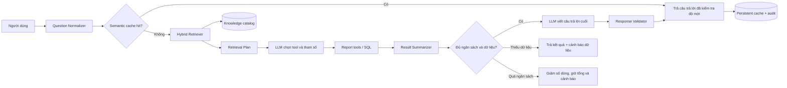

# Thiết kế kỹ thuật: Hybrid RAG cho Trợ lý điều hành VLife

**Trạng thái:** Bản đề xuất để review, chưa triển khai  
**Ngày:** 25/09/2026  
**Phạm vi:** `vl-api`, database `vlife2`; chỉ thay đổi CMS nếu cần màn hình giám sát sau này

## 1. Quyết định đề xuất

Áp dụng **Hybrid RAG** cho phần định tuyến câu hỏi và truy xuất kiến thức nghiệp vụ. Số liệu doanh thu, công nợ, giá vốn, lợi nhuận, tồn kho và đơn hàng vẫn phải được lấy và tính bằng report service/SQL hiện có.

Không đưa giao dịch thô vào vector database. Không để model tự viết SQL, tự cộng số liệu hoặc tự suy ra dữ liệu còn thiếu.

Luồng mục tiêu:

1. Chuẩn hóa câu hỏi và ngữ cảnh hội thoại.
2. Tìm ý định, report tool và quy tắc nghiệp vụ phù hợp bằng truy xuất lai: từ khóa + embedding.
3. Chỉ gửi 3–6 tool schema liên quan cho model, thay vì toàn bộ tool.
4. Backend chạy report và tính toán.
5. Nén kết quả report thành payload dành riêng cho model.
6. Model viết câu trả lời cuối cùng từ số liệu đã được tính sẵn.
7. Cache kết quả theo ý định, tham số, quyền dữ liệu và phiên bản nguồn.

Mục tiêu là giảm token đầu vào mà **không giảm độ đầy đủ của câu trả lời**. Không giảm `max_output_tokens` để tiết kiệm chi phí.

## 2. Hiện trạng và nguyên nhân tốn token

Audit production cho thấy:

| Thời điểm | Request | Input token | Cached input | Output token |
|---|---:|---:|---:|---:|
| 23/09/2026 | 44 | 534.129 | 52.163 | 36.505 |
| 24/09/2026 20:54 | 1 | 133.868 | 0 | 3.679 |

Request ngày 24/09 là trường hợp bất thường nghiêm trọng: input lớn gấp nhiều lần output.

Các nguyên nhân trong code hiện tại:

- Lần gọi đầu gửi toàn bộ khoảng 30 tool schema được cấp quyền.
- Prompt hệ thống chứa toàn bộ quy tắc cho mọi nghiệp vụ dù câu hỏi chỉ liên quan một báo cáo.
- Tối đa 6 message lịch sử được gửi nguyên văn.
- Sau khi tool chạy, `safeJson` có thể chứa danh sách dài và nhiều trường không cần cho phần diễn giải.
- Vòng tiếp theo gửi lại instructions, input trước, output trước, tool call và tool output.
- Một câu hỏi nhiều tool làm payload tăng lũy tiến qua các vòng.
- Cache hiện tại nằm trong RAM, TTL 5 phút, khóa theo nguyên văn câu hỏi đã chuẩn hóa và không dùng được cho câu hỏi tương đồng.
- Cache mất khi restart/deploy và không biết dữ liệu nguồn đã thay đổi hay chưa.

## 3. Mục tiêu có thể đo

### Token và chi phí

- Câu hỏi một báo cáo: **p95 không quá 6.000 input token** cho toàn bộ request.
- Câu hỏi phân tích nhiều báo cáo: **p95 không quá 15.000 input token**.
- Giới hạn cứng: **25.000 input token** cho toàn bộ các vòng của một câu hỏi.
- Query embedding mục tiêu dưới 150 token và được cache.
- Không giảm giới hạn output hiện tại chỉ để đạt mục tiêu chi phí.

### Chất lượng

- Tổng, tỷ lệ, xếp hạng và khoảng ngày phải khớp report/SQL 100% trong bộ test chuẩn.
- Không mất các cảnh báo dữ liệu ảnh hưởng kết luận.
- Không đổi “thiếu dữ liệu” thành 0.
- Không gọi lợi nhuận gộp tạm tính là lợi nhuận ròng.
- Doanh thu theo khách hàng luôn có lợi nhuận và tỷ suất nếu dữ liệu đủ.
- Câu trả lời phân tích vẫn có kết luận, số liệu chính, nhận định và việc nên làm.
- Câu hỏi khác cách diễn đạt nhưng cùng ý nghĩa phải chọn cùng report plan khi tham số giống nhau.

### Vận hành

- p95 câu hỏi một tool dưới 15 giây; câu hỏi nhiều tool dưới 30 giây.
- Không tăng RSS của API quá 32 MB cho catalog RAG và cache trong tiến trình.
- RAG hoặc embedding lỗi không làm chatbot ngừng hoạt động; phải fallback về định tuyến an toàn.

## 4. Nguyên tắc thiết kế

1. **SQL là nguồn sự thật cho con số.** RAG chỉ cung cấp ngữ nghĩa và hướng dẫn chọn report.
2. **Output quan trọng hơn việc giảm token.** Chỉ loại dữ liệu lặp, schema không liên quan và dòng chi tiết không cần thiết.
3. **Không hardcode từng câu hỏi.** Catalog mô tả năng lực, trường dữ liệu, từ đồng nghĩa và ví dụ ý định; một intent phục vụ nhiều cách hỏi.
4. **Phân quyền trước truy xuất.** Không retrieve tool, knowledge chunk hoặc cache entry ngoài quyền người dùng.
5. **Cache phải biết độ mới dữ liệu.** Không trả số cũ chỉ vì câu hỏi giống nhau.
6. **Không che lỗi dữ liệu.** RAG không được dùng để “điền” giá vốn, hạn thanh toán, ngày giao hoặc hạn dùng còn thiếu.

## 5. Kiến trúc đề xuất



### 5.1 `QuestionNormalizer`

Đầu vào gồm câu hỏi hiện tại và trạng thái hội thoại có cấu trúc. Kết quả:

```text
normalized_text
date_range
comparison_range
dimensions: customer | product | product_group | employee | region
metrics: revenue | gross_profit | receivable | quantity | return
filters
requested_detail: summary | top | full_list
```

Không dùng regex để quyết định toàn bộ intent. Regex chỉ được dùng cho dữ liệu có cấu trúc rõ ràng như ngày, phần trăm, top N và mã chứng từ.

### 5.2 `HybridRetriever`

Kết hợp hai điểm số:

- **Lexical score:** từ khóa tiếng Việt, tên chỉ tiêu, alias nghiệp vụ, mã tool.
- **Semantic score:** cosine similarity giữa embedding câu hỏi và embedding catalog.

Điểm cuối:

```text
score = 0,45 * lexical + 0,55 * semantic + permission_bonus + context_bonus
```

Các hệ số phải cấu hình được và được hiệu chỉnh bằng bộ eval; không coi giá trị ban đầu là cố định.

Retriever trả về:

- 3–6 tool phù hợp nhất.
- Tối đa 6 knowledge chunk, mỗi chunk tối đa khoảng 800 ký tự.
- Confidence và lý do chọn.
- Các tool bắt buộc đi cùng nhau, ví dụ lợi nhuận sản phẩm + lợi nhuận khách hàng khi người dùng hỏi đồng thời hai chiều.

Nếu confidence thấp, hệ thống mở rộng catalog tool nhưng vẫn giữ giới hạn ngân sách. Nếu embedding lỗi, dùng lexical retrieval và quan hệ tool hiện có.

### 5.3 `KnowledgeCatalog`

Catalog chỉ chứa kiến thức ổn định và có nguồn:

- Định nghĩa doanh thu thuần, hàng trả lại, dư công nợ.
- Phân biệt lợi nhuận gộp tạm tính và lợi nhuận ròng.
- Quy tắc độ phủ giá vốn, trạng thái `INCOMPLETE`, `UNDEFINED_RATIO`.
- Ý nghĩa và giới hạn của từng report tool.
- Quan hệ bắt buộc giữa intent, tool và dimension.
- Từ đồng nghĩa: sale/nhân viên kinh doanh/nhân viên; vùng/khu vực; sản phẩm/mặt hàng.
- Quy tắc cảnh báo dữ liệu và cách trình bày.
- Một số ví dụ intent có tham số, không lưu câu trả lời hoặc con số cố định.

Không lưu giao dịch khách hàng, giá bán, công nợ hay dữ liệu nhạy cảm vào embedding.

### 5.4 `PromptAssembler`

Prompt được chia thành module:

- `core`: ngôn ngữ, trung thực dữ liệu, không tự tính lại số.
- `intent`: quy tắc đúng với intent vừa retrieve.
- `data_quality`: chỉ các cảnh báo liên quan nguồn được dùng.
- `response_contract`: cấu trúc đầu ra tùy loại câu hỏi.

Không gửi toàn bộ prompt nghiệp vụ hiện tại trong mỗi request.

Payload đầu tiên gồm:

```text
core instructions
retrieved knowledge chunks
conversation state
current question
top-k authorized tool schemas
```

### 5.5 `ConversationState`

Thay vì gửi 6 message đầy đủ, lưu trạng thái có cấu trúc:

```json
{
  "fromDate": "2026-09-01",
  "toDate": "2026-09-25",
  "comparison": "previous_equal_days",
  "dimension": "customer",
  "metric": ["net_revenue", "gross_margin"],
  "filters": {},
  "lastReportIds": ["customer_sales_performance"]
}
```

Gửi tối đa 2 lượt hội thoại gần nhất khi câu hỏi phụ thuộc câu chữ trước đó. Các lượt cũ hơn được biểu diễn bằng state, không dùng bản tóm tắt tự do có thể làm sai tham số.

### 5.6 `ResultSummarizer`

Tạo hai payload tách biệt:

- `clientPayload`: dữ liệu đầy đủ cần cho bảng, chart, nguồn và tải xuống.
- `modelPayload`: dữ liệu tối thiểu để model nhận định chính xác.

`modelPayload` luôn giữ:

- Tổng toàn bộ dữ liệu.
- Khoảng ngày và ngày dữ liệu mới nhất.
- Số nhóm/tổng số bản ghi.
- Top N phù hợp yêu cầu.
- Coverage, missing count và warnings.
- Các trường cần cho kết luận nghiệp vụ.

`modelPayload` loại:

- Field nội bộ không dùng để trả lời.
- Dữ liệu chart trùng với bảng.
- Source metadata lặp ở từng dòng.
- Các trang sau khi người dùng chỉ hỏi top/tổng hợp.

Giới hạn mặc định:

- Summary: tối đa 10 dòng.
- Ranking: tối đa 20 dòng.
- Phân tích sâu: tối đa 30 dòng.
- “Liệt kê toàn bộ”: không gửi toàn bộ cho model; backend xuất dữ liệu đầy đủ, model chỉ viết phần tổng hợp.

### 5.7 `ResponseValidator`

Sau khi model trả lời, validator kiểm tra các điều kiện có thể xác định bằng code:

- Tổng tiền và tỷ lệ được nêu phải tồn tại trong model payload.
- Không ghi “đầy đủ” khi coverage chưa đủ.
- Không gọi doanh thu theo dimension bằng tên tiếng Anh.
- Có cảnh báo bắt buộc khi report đánh dấu dữ liệu thiếu.
- Có tỷ suất lợi nhuận trong các báo cáo khách hàng yêu cầu trường này.

Nếu vi phạm, chỉ thực hiện một lượt repair nhỏ với lỗi cụ thể và payload rút gọn. Nếu hết ngân sách, dùng renderer backend để trả bảng và cảnh báo đúng thay vì gọi model tiếp.

## 6. Lưu trữ RAG và cache

MySQL production hiện là MariaDB/MySQL cũ, không có vector index phù hợp. Catalog dự kiến nhỏ nên dùng bảng thường và cosine trong Java.

### 6.1 Bảng kiến thức

```sql
CREATE TABLE ai_knowledge_chunks (
    id BIGINT PRIMARY KEY AUTO_INCREMENT,
    chunk_key VARCHAR(150) NOT NULL,
    category VARCHAR(50) NOT NULL,
    title VARCHAR(255) NOT NULL,
    content TEXT NOT NULL,
    tool_names VARCHAR(1000) NULL,
    permission_modules VARCHAR(500) NULL,
    content_hash CHAR(64) NOT NULL,
    version INT NOT NULL,
    active TINYINT(1) NOT NULL DEFAULT 1,
    updated_at TIMESTAMP NOT NULL,
    UNIQUE KEY uk_ai_knowledge_chunk_key_version (chunk_key, version)
);

CREATE TABLE ai_knowledge_embeddings (
    chunk_id BIGINT PRIMARY KEY,
    model VARCHAR(100) NOT NULL,
    dimensions INT NOT NULL,
    embedding MEDIUMBLOB NOT NULL,
    updated_at TIMESTAMP NOT NULL
);
```

Embedding lưu dạng float32 binary. Với vài trăm chunk, bộ nhớ dự kiến dưới 5 MB; đặt giới hạn cấu hình 1.000 chunk và cache tối đa 32 MB.

### 6.2 Persistent semantic cache

```sql
CREATE TABLE ai_response_cache (
    id BIGINT PRIMARY KEY AUTO_INCREMENT,
    cache_key CHAR(64) NOT NULL,
    user_scope_hash CHAR(64) NOT NULL,
    intent VARCHAR(100) NOT NULL,
    parameters_hash CHAR(64) NOT NULL,
    source_version VARCHAR(255) NOT NULL,
    response_json MEDIUMTEXT NOT NULL,
    expires_at TIMESTAMP NOT NULL,
    created_at TIMESTAMP NOT NULL,
    last_hit_at TIMESTAMP NULL,
    hit_count INT NOT NULL DEFAULT 0,
    UNIQUE KEY uk_ai_response_cache_key (cache_key),
    KEY idx_ai_response_cache_expiry (expires_at)
);
```

Cache key không dựa trên câu chữ nguyên văn:

```text
intent + normalized parameters + permission scope + source version
```

Ví dụ “xếp hạng doanh thu theo customer” và “doanh thu theo khách hàng từ cao xuống thấp” dùng chung key khi cùng kỳ, limit và quyền.

`source_version` lấy từ ngày/chứng từ cập nhật mới nhất của các nguồn report. Cache tự mất hiệu lực khi dữ liệu nguồn thay đổi, không chỉ dựa vào TTL.

Không dùng chung cache giữa hai người có phạm vi dữ liệu khác nhau.

## 7. Kiểm soát ngân sách token

Tạo `TokenBudget` cho toàn request:

| Thành phần | Câu đơn giản | Câu nhiều báo cáo |
|---|---:|---:|
| Core + knowledge | 1.200 | 2.000 |
| Tool schema | 1.500 | 3.000 |
| Hội thoại/state | 500 | 1.000 |
| Tool result | 2.000 | 6.000 |
| Repair dự phòng | 800 | 2.000 |
| Mục tiêu tổng | ≤ 6.000 | ≤ 15.000 |

Trước mỗi lần gọi model:

1. Ước lượng token của request.
2. Nếu vượt budget, giảm số dòng chi tiết trước.
3. Luôn giữ totals, coverage, warnings và top có giá trị lớn nhất.
4. Không cắt giữa một JSON object.
5. Không gọi vòng tiếp theo nếu tổng token dự kiến vượt giới hạn cứng.

## 8. Luồng xử lý chi tiết

```text
handle(userId, question, conversationId)
  authorize(userId)
  normalized = normalizer.normalize(question, conversationState)
  sourceVersion = sourceVersionResolver.resolve(normalized.domains)

  if persistentCache.hit(normalized, userScope, sourceVersion)
      return cachedResponse

  retrieval = retriever.search(normalized, authorizedCatalog)
  prompt = promptAssembler.initial(normalized, retrieval)
  budget.assertFits(prompt)

  selection = openAi.selectTools(prompt, retrieval.tools)
  executions = executeSelectedTools(selection)
  modelPayload = resultSummarizer.compact(executions, normalized)

  if executions contain blocking data gaps
      answer = safeRenderer.renderWithDataWarnings(modelPayload)
  else
      finalPrompt = promptAssembler.final(normalized, retrieval.rules, modelPayload)
      budget.assertFitsOrCompact(finalPrompt)
      answer = openAi.compose(finalPrompt)

  validated = responseValidator.validate(answer, modelPayload)
  result = repairOnceOrRender(validated)
  persistentCache.put(result, normalized, userScope, sourceVersion)
  audit(result, retrieval, budget, cache)
  return result
```

## 9. Phân quyền và bảo mật

- Lọc catalog theo permission trước khi tính similarity.
- Không đưa tên khách hàng hoặc giao dịch vào knowledge embeddings.
- Cache chứa kết quả nghiệp vụ phải mã hóa/giới hạn quyền tương đương conversation hiện tại.
- `user_scope_hash` bao gồm role, permission module và phạm vi dữ liệu nếu sau này có scope theo vùng/sale.
- Không ghi prompt đầy đủ hoặc dữ liệu khách hàng vào application log.
- Audit chỉ ghi token, chunk key, tool, duration, cache status và mã lỗi.
- Nội dung retrieved được coi là dữ liệu, không phải system instruction; chống prompt injection từ tài liệu nghiệp vụ.

## 10. Audit và quan sát vận hành

Bổ sung vào `ai_chat_audits` hoặc bảng detail:

```text
route_intent
route_confidence
retrieved_chunk_keys
offered_tool_count
used_tool_count
tool_payload_chars
request_count_to_openai
embedding_input_tokens
cache_status: MISS | EXACT_HIT | SEMANTIC_HIT | STALE
validator_status
fallback_type
```

Dashboard nội bộ cần theo dõi theo ngày:

- Input/output/cached token trung bình và p95.
- Token theo intent/tool.
- Tỷ lệ cache hit.
- Tỷ lệ chọn đúng tool.
- Timeout và repair rate.
- Câu vượt 15.000 và 25.000 token.
- Chất lượng dữ liệu theo report.

## 11. Bộ eval bắt buộc trước khi bật

Tạo bộ câu hỏi chuẩn từ nhu cầu thực tế, có nhiều cách diễn đạt cho cùng intent:

- Doanh thu theo khách hàng/nhóm hàng/sale/vùng.
- Doanh thu khách hàng kèm tỷ suất lợi nhuận.
- Sản phẩm chênh giá bán/giá vốn dưới 10%.
- Top khách dư công nợ kèm lợi nhuận và nhận định rủi ro.
- Khách VIP có công nợ quá hạn.
- Khách cần chăm sóc lại, khách giảm mua, khách mới.
- Đơn đang mở, giao trễ, shipment đang về.
- Tồn kho âm, hết hạn, thiếu hạn dùng.
- Câu nối tiếp: “so với tháng trước”, “còn theo sale thì sao”.
- Câu yêu cầu toàn bộ danh sách và câu chỉ yêu cầu top.
- Câu có dữ liệu thiếu/sai.

Mỗi case có expected:

```text
intent
tool plan
arguments
required totals/fields
required warnings
forbidden claims
maximum input token
```

Điều kiện đạt:

- 100% con số bắt buộc khớp report fixture.
- Ít nhất 98% chọn đúng tool plan; 100% với nhóm câu hỏi tài chính trọng yếu.
- Không có regression về cảnh báo dữ liệu.
- Điểm review nội dung không thấp hơn hệ thống hiện tại.
- Mọi case nằm trong token budget tương ứng.

## 12. Cơ chế bật và quay lui

Các cờ cấu hình:

```yaml
ai.chat.rag.enabled: false
ai.chat.rag.shadow-mode: true
ai.chat.rag.max-tools: 6
ai.chat.rag.max-chunks: 6
ai.chat.token-budget.simple: 6000
ai.chat.token-budget.complex: 15000
ai.chat.token-budget.hard-limit: 25000
ai.chat.persistent-cache.enabled: true
```

Trước khi chuyển traffic, chạy router mới ở shadow mode trên câu hỏi thật nhưng không gọi thêm model; chỉ ghi plan để so với plan hiện tại. Khi bật, giữ cờ quay về pipeline cũ ngay lập tức nếu tool accuracy, timeout hoặc chất lượng giảm.

Đây là cơ chế an toàn triển khai, không phải chia nhỏ chất lượng sản phẩm. Bản phát hành chính thức chỉ được coi là hoàn thành khi toàn bộ tiêu chí mục 11 đạt.

## 13. Thay đổi dự kiến trong code

### Thành phần mới

```text
AiQuestionNormalizer
AiConversationStateService
AiKnowledgeRepository
AiEmbeddingClient
AiHybridRetriever
AiPromptAssembler
AiResultSummarizer
AiTokenBudget
AiResponseValidator
AiPersistentCacheService
AiSourceVersionResolver
AiEvalRunner
```

### Thành phần sửa

- `AiChatService`: điều phối pipeline mới và budget toàn request.
- `AiToolRegistry`: xuất catalog metadata và chỉ trả top-k tool.
- `AiToolExecutor`: trả riêng client payload và model payload.
- `OpenAiClient`: nhận prompt module rút gọn; audit usage theo từng call.
- `AiResponseCacheService`: chuyển từ RAM exact-match sang L1 RAM + L2 database semantic key.
- `AiChatAuditService`: ghi routing, cache, payload size và token theo từng call.
- `AiConversationService`: lưu conversation state có cấu trúc.

## 14. Những việc không làm

- Không vector hóa toàn bộ database nghiệp vụ.
- Không cho model chạy SQL tùy ý.
- Không đổi model chat chỉ để giảm chi phí.
- Không giảm độ dài output một cách cơ học.
- Không cache vượt quyền hoặc bỏ qua độ mới dữ liệu.
- Không tạo danh sách hardcode cho mọi câu hỏi người dùng có thể nhập.
- Không tự sửa dữ liệu thiếu/sai.

## 15. Điểm cần duyệt trước khi triển khai

1. Duyệt kiến trúc Hybrid RAG: RAG cho metadata/quy tắc, SQL cho con số.
2. Duyệt ngân sách: 6.000 token câu đơn giản, 15.000 câu phức tạp, hard limit 25.000.
3. Duyệt persistent cache trong database và khóa cache theo quyền + source version.
4. Duyệt việc dùng embedding API cho câu hỏi/corpus nhỏ; chatbot vẫn dùng model hiện tại.
5. Duyệt tiêu chí “không giảm output”: eval nội dung phải bằng hoặc tốt hơn trước khi bật.
6. Duyệt việc chỉ triển khai sau khi shadow routing và bộ regression đạt yêu cầu.

